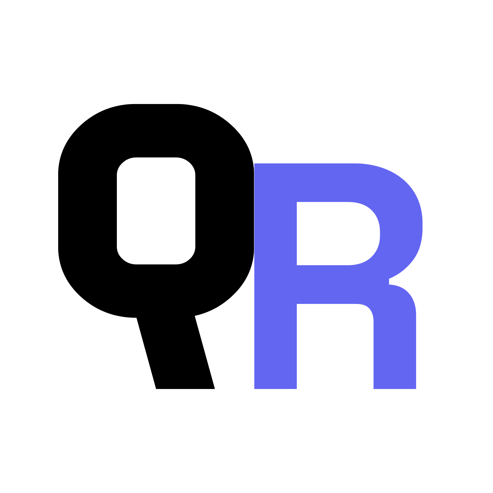

<div align="center">
  
  <h1>QR Studio</h1>
  <p><strong>Aplicação web moderna para geração e personalização avançada de QR Codes em tempo real.</strong></p>

  <p>
    <a href="#-funcionalidades"></a>
    <a href="https://www.python.org/"></a>
    <a href="https://flask.palletsprojects.com/"></a>
    <a href="https://developer.mozilla.org/pt-BR/docs/Web/JavaScript"></a>
  </p>
</div>

---

## 📖 Sumário

- [Sobre o Projeto](#-sobre-o-projeto)
- [Funcionalidades](#-funcionalidades)
- [Tecnologias Utilizadas (Tech Stack)](#-tecnologias-utilizadas-tech-stack)
- [Estrutura do Projeto](#-estrutura-do-projeto)
- [Pré-requisitos](#-pré-requisitos)
- [Passo a Passo de Instalação](#-passo-a-passo-de-instalação)
- [Como Usar a Aplicação](#-como-usar-a-aplicação)
- [Licença](#-licença)

---

## 🚀 Sobre o Projeto

O **QR Studio** é uma solução completa que transforma o script básico em Python em uma aplicação web fluida, responsiva e elegante. Desenvolvido com arquitetura **Back-end em Python (Flask)** e **Front-end em HTML5/CSS3/JavaScript Vanilla**, a aplicação permite criar QR Codes customizados para diferentes finalidades (links, redes Wi-Fi, conversas no WhatsApp e cartões vCard), com suporte a cores personalizadas, fundo transparente, logotipo central e estilos geométricos variados.

---

## ✨ Funcionalidades

- 📋 **Templates Prontos:**
  - **Link / Texto Livre:** URLs genéricas ou qualquer texto.
  - **Wi-Fi Conect:** Gera QR Code de conexão automática para redes sem fio.
  - **WhatsApp Direct:** Link direto para conversa com mensagem pré-formatada.
  - **vCard Virtual:** Cartão de contatos pronto para salvar na agenda do celular.
- 🎨 **Personalização Visual Completa:**
  - Seletor visual de cor com sincronização bidirecional e suporte a colagem HEX (`#RRGGBB`).
  - **Fundo Transparente (PNG com canal Alpha).**
  - **Formatos Geométricos dos Pontos:** Quadrados, Bolinhas (Círculos), Cantos Arredondados, Espaçados e Barras.
- 🖼️ **Inclusão de Logotipo Central:** Upload de imagem PNG/JPG com correção automática de erros do QR Code (`ERROR_CORRECT_H`).
- 📐 **Ajuste de Resolução:** Slider dinâmico para controle de tamanho da imagem gerada.
- ⚡ **Ações Rápidas:**
  - Download direto da imagem PNG.
  - Copiar imagem para a área de transferência via _Clipboard API_.
- 📱 **Interface Fluida e Responsiva:** Design estilo _Dark Glassmorphism_, com micro-animações, _glider_ deslizante nas abas e adaptabilidade total para dispositivos móveis.

---

## 🛠️ Tecnologias Utilizadas (Tech Stack)

### **Back-end**

- **[Python](https://www.python.org/):** Linguagem principal do servidor.
- **[Flask](https://flask.palletsprojects.com/):** Micro-framework web leve e rápido.
- **[qrcode](https://pypi.org/project/qrcode/):** Biblioteca para geração da matriz e dados do QR Code com suporte ao `StyledPilImage`.
- **[Pillow (PIL)](https://python-pillow.org/):** Processamento de imagens em memória (`io.BytesIO`), redimensionamento de logotipos e manipulação de transparência RGBA.

### **Front-end**

- **HTML5 Semântico:** Estruturação organizada em abas e painéis acessíveis.
- **CSS3 Moderno:**
  - Variáveis CSS (Custom Properties).
  - _Glassmorphism_, gradientes ambientes e sombras dinâmicas.
  - Media Queries para **100% de responsividade em telas móbiles**.
  - Fontes web: _Plus Jakarta Sans_ e _Space Grotesk_.
- **JavaScript Vanilla (ES6+):**
  - Requisições assíncronas com `Fetch API` enviando `FormData`.
  - Manipulação dinâmica do DOM e cálculo do _glider_ animado.
  - Cópia para Clipboard via `navigator.clipboard`.

---

## 📂 Estrutura do Projeto

```text
gerador-qrcode/
│
├── app.py                  # Servidor Flask e rotas da API
├── templates/
│   └── index.html          # Interface principal
└── static/
    ├── favicon.svg         # Ícone vetorial do projeto
    ├── style.css           # Estilização visual e regras responsivas
    └── script.js           # Lógica do front-end e interatividade
```
